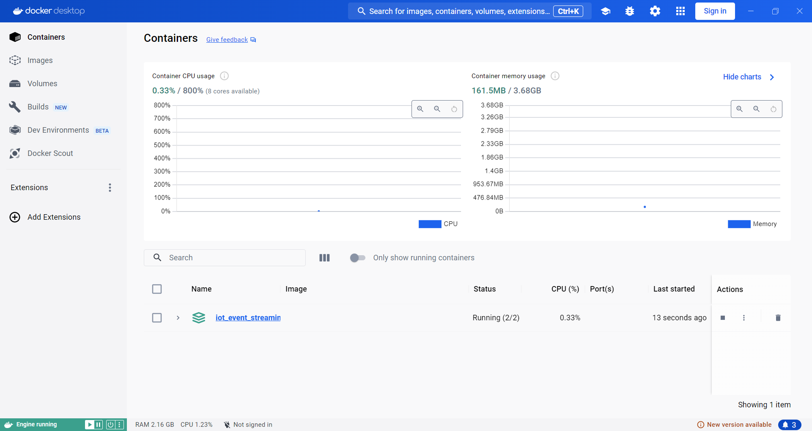
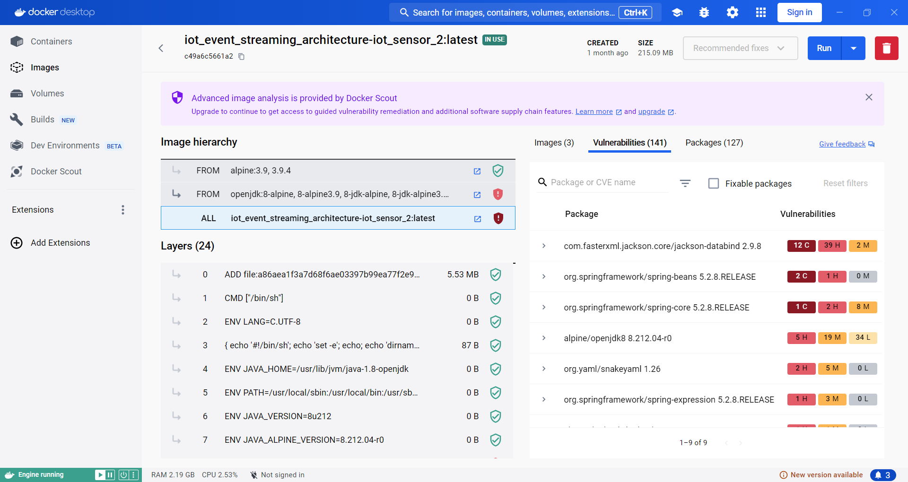

# MQTT

## iot-sensor-2
คือการจำลองข้อมูลของเซ็นเซอร์ซึ่งที่อยู่ในคอมพิวเตอร์ทำงานภายใน Docker โดยข้อมูลนี้เป็นค่าที่ได้จากการ generateขึ้น จากนั้นส่งข้อมูลผ่าน Protocal MQTT ไปยัง Server เพื่อให้ประมวลผลกับแสดงผล

(ภาพตอนรันโปรแกรม)
.png)

.png)

