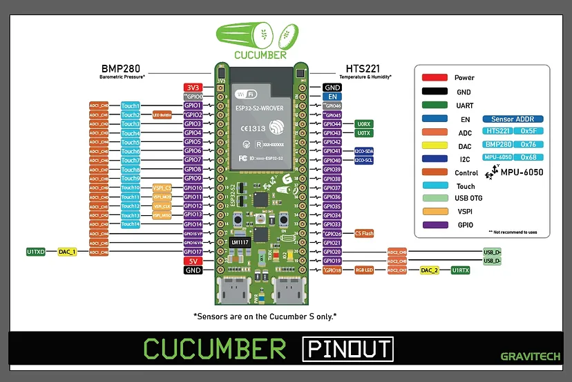
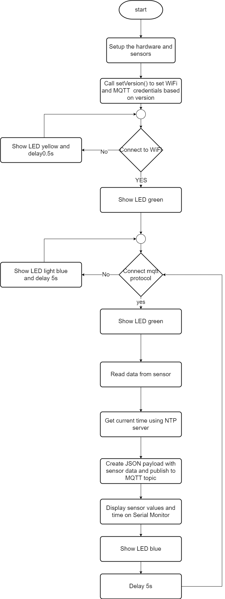

# Ingest and store real-time data from IoT sensors.


## MQTT Topic
MQTT Topic คือหัวข้อที่ใช้ในการรับส่งข้อมูลระหว่าง Publisher และ Subscriber ในระบบ MQTT
หลักการทำงานของ MQTT คือการประกาศTopic ใน Broker จากนั้น Publisher จะส่งข้อมูลไปยัง Topic นั้นๆ และ Subscriber ก็จะได้รับข้อมูลทั้งหมดใน Topic นั้นๆโดยในcodeผมคือ client.publish("iot-frames", jsonData); ซึ่งtopicคือ iot-frames


## MQTT Payload
 esp32s2dev module cucumberจะรับข้อมูลต่าๆจากsensorที่กำหนด เพื่อส่งไปยัง mqtt serverเเต่การส่งข้อมูลไปหาmqtt serverจะต้องมีการกำหนดรูปแบบของ Payloadเพื่อให้mqtt serverสามารถรับข้อมูลได้ โดยรูปเเบบPayloadของกลุ่มผมคือ
 ```
 StaticJsonDocument<512> jsonDoc;
jsonDoc["id"] = "43245253";  // รหัสเซ็นเซอร์
jsonDoc["name"] = sensor_name;  // ชื่อของเซ็นเซอร์
jsonDoc["place_id"] = "42343243";  // รหัสสถานที่
jsonDoc["date"] = NTP.getTimeDateString(time(NULL), "%Y-%m-%dT%H:%M:%S");  // วันที่และเวลาในรูปแบบ ISO 8601
jsonDoc["timestamp"] = epochTime;  // เวลาปัจจุบันในรูปแบบ epoch time
JsonObject payload = jsonDoc.createNestedObject("payload");
payload["temperature"] = temp;      // อุณหภูมิที่วัดได้จาก BMP280
payload["humidity"] = humid;        // ความชื้นที่วัดได้จาก SHT4x
payload["pressure"] = pressure;     // ความดันอากาศที่วัดได้จาก BMP280
payload["luminosity"] = analogval;  // ความเข้มแสงที่วัดได้จากเซ็นเซอร์แบบอนาล็อก

char jsonData[512];
serializeJson(jsonDoc, jsonData);
client.publish("iot-frames", jsonData);
```
การใช้งาน MQTT Payload
Publisher จะสร้าง Payload โดยใส่ข้อมูลลงใน JSON Document จากนั้นใช้ฟังก์ชัน serializeJson() เพื่อแปลงข้อมูล JSON ให้อยู่ในรูปแบบข้อความ แล้วจึงส่งข้อมูลนี้ผ่านคำสั่ง client.publish("iot-frames", jsonData);
Subscriber จะต้องดักรับข้อมูลจาก Topic ที่สนใจ เช่น "iot-frames" และทำการถอดรหัส JSON Payload เพื่อดึงข้อมูลที่ต้องการออกมาใช้งาน

## ESP32
จากboardที่อ.ให้มาคือ esp32s2dev module cucumberโดยsensorที่ใช้จะมี BMP280 ใช้วัดอุณหภูมิและความดัน SHT4x วัดความชื้น เเละ KY-018ที่ต่อเพิ่มมาตรงขา5เพื่อใช้วัดค่าเเสง รวมถึงมีการให้ทำLEDในการดูสถานะต่างๆ



## code
``` cpp
#include <Wire.h>
#include <Adafruit_BMP280.h>
#include <SensirionI2cSht4x.h>
#include <PubSubClient.h>
#include <WiFi.h>
#include <ESPNtpClient.h>
#include <ArduinoJson.h>
#include <Adafruit_NeoPixel.h>

#define LED_PIN 18          // LED pin
#define LED_COUNT 60        // Number of LEDs in the strip
#define BRIGHTNESS 50       // Brightness level (0-255)

// NeoPixel strip object
Adafruit_NeoPixel strip(LED_COUNT, LED_PIN, NEO_GRB + NEO_KHZ800);

// Colors of LEDs
#define RED_COLOR 255,0,0
#define YELLOW_COLOR 255,255,0
#define GREEN_COLOR 0,255,0
#define WHITE_COLOR 255,255,255
#define BLUE_COLOR 0,0,255
#define ORANGE_COLOR 255,165,0

// WiFi and MQTT configurations
const char* ssid;
const char* password;
String mqtt_server; // Changed from const char* to String
const int mqtt_port = 1883;
const PROGMEM char* ntpServer = "158.108.212.149";

// Sensor and network objects
Adafruit_BMP280 bmp280;
WiFiClient espClient;
PubSubClient client(espClient);
WiFiServer server(1883);

// Pins and error handling
const int sensorPin = 5;
static char errorMessage[64];
static int16_t error;
#define NO_ERROR 0

// Network IP configurations
IPAddress gateway(172, 16, 46, 254);
IPAddress subnet(255, 255, 255, 0);

// Define versions
enum Version {
    NOR,
    PHAI,
    JAE,
    JI,
    PON,
    KONG,
    NORT,
    BIG,
    SPA,
    GATE
};

// Function prototypes
void setup_wifi();
void mqtt_handle();
void init_BMP280();
void init_SHT4x();
void checkError(int16_t error, const char* errorMsg);
void init_NTP();
unsigned long Get_EpochTime();
void setVersion(Version v);

// Global variables
const char* mqtt_user;
const char* mqtt_pass;
IPAddress local_IP;
String sensor_name;  // Global variable for sensor name
SensirionI2cSht4x sensor;  // Initialize the SHT4x sensor

void setup() {
    Wire.begin(41, 40);
    setVersion(GATE); // กำหนดเวอร์ชันก่อน
    setup_wifi();  // ตอนนี้ ssid และ password จะมีค่าที่ถูกต้อง
    client.setServer(mqtt_server.c_str(), mqtt_port); // Convert String to const char* for setServer
    server.begin();

    if (!WiFi.config(local_IP, gateway, subnet)) {
        Serial.println("WiFi configuration failed");
    }

    init_BMP280();
    init_SHT4x();
    init_NTP();

    // Initialize NeoPixel
    strip.begin();
    strip.setBrightness(BRIGHTNESS);
    strip.show(); // Initialize all pixels to 'off'
}

void loop() {
    if (!client.connected()) {
        mqtt_handle();
    }
    client.loop();

    // อ่านข้อมูลจากเซ็นเซอร์
    float temp = bmp280.readTemperature();
    float pressure = bmp280.readPressure() / 100.0;  // แปลงแรงดันเป็นบาร์
    float temps = 0.0;
    float humid = 0.0;
    error = sensor.measureLowestPrecision(temps, humid);
    checkError(error, "ข้อผิดพลาดในการวัดด้วย SHT4x");

    // อ่านค่าจากแอนะล็อก
    int analogval = analogRead(sensorPin);

    // รับเวลาปัจจุบันในรูปแบบ epoch
    unsigned long epochTime = Get_EpochTime();

    // พิมพ์ข้อมูลลงใน Serial Monitor
    Serial.print("อุณหภูมิ: ");
    Serial.println(temp);
    Serial.print("แรงดัน: ");
    Serial.print(pressure, 7);  // พิมพ์แรงดันด้วยตำแหน่งทศนิยม 7 ตำแหน่ง
    Serial.println();
    Serial.print("ความชื้น: ");
    Serial.println(humid);
    Serial.print("แสง: ");
    Serial.println(analogval);

    // สร้างและเผยแพร่ข้อมูล JSON
    StaticJsonDocument<512> jsonDoc;
    jsonDoc["id"] = "43245253";
    jsonDoc["name"] = sensor_name;  // ใช้ชื่อเซ็นเซอร์จากกรณีที่กำหนด
    jsonDoc["place_id"] = "42343243";
    jsonDoc["date"] = NTP.getTimeDateString(time(NULL), "%Y-%m-%dT%H:%M:%S");
    jsonDoc["timestamp"] = epochTime;

    JsonObject payload = jsonDoc.createNestedObject("payload");
    payload["temperature"] = temp;      // อุณหภูมิ
    payload["humidity"] = humid;        // ความชื้น
    payload["pressure"] = pressure;     // แรงดัน
    payload["luminosity"] = analogval;  // แสง

    char jsonData[512];
    serializeJson(jsonDoc, jsonData);
    client.publish("iot-frames", jsonData);

    Serial.print("เวลา: ");
    Serial.print(NTP.getTimeDateString(time(NULL), "%Y-%m-%dT%H:%M:%S"));
    Serial.println();
    BLUELED();
    delay(5000);  // หน่วงเวลา 5 วินาที ก่อนวนลูปถัดไป
}

// Function to connect to WiFi
void setup_wifi() {
    Serial.begin(115200);
    delay(10);
    Serial.println();
    Serial.print("Connecting to ");
    Serial.println(ssid);
    GREENLED();
    WiFi.begin(ssid, password);

    while (WiFi.status() != WL_CONNECTED) {
    // Show yellow light while connecting to WiFi
      YELLOWLED();
      delay(500);
      Serial.print(".");
    }
    
    Serial.println();
    Serial.println("Connected to WiFi!");
    Serial.print("IP address: ");
    Serial.println(WiFi.localIP());
}

// Function to handle MQTT connection
void mqtt_handle() {
    while (!client.connected()) {
        Serial.print("Connecting to MQTT...");

        if (client.connect("NOR", mqtt_user, mqtt_pass)) {  // Add username and password here
          WHITELED();
          Serial.println("Connected");
          client.subscribe("esp32/sensorData");
        } else {
            Serial.print("Failed to connect, state: ");
            Serial.println(client.state());

            // Show orange light when connection fails
             LIGHTBLUELELED();

            Serial.println("Retrying in 5 seconds...");
            delay(5000);
        }
    }
}

// Function to initialize BMP280 sensor
void init_BMP280() {
    if (!bmp280.begin(0x76)) {
        Serial.println(F("BMP280 initialization failed"));
        while (1) delay(10);
    }
    bmp280.setSampling(
        Adafruit_BMP280::MODE_NORMAL,
        Adafruit_BMP280::SAMPLING_X2,
        Adafruit_BMP280::SAMPLING_X16,
        Adafruit_BMP280::FILTER_X16,
        Adafruit_BMP280::STANDBY_MS_500);
    Serial.println("BMP280 initialized");
}

// Function to initialize SHT4x sensor
void init_SHT4x() {
    sensor.begin(Wire, SHT40_I2C_ADDR_44);
    sensor.softReset();
    delay(10);

    uint32_t serialNumber = 0;
    error = sensor.serialNumber(serialNumber);
    checkError(error, "Error retrieving serial number");
    Serial.print("Serial Number: ");
    Serial.println(serialNumber);
}

// Function to check and handle errors
void checkError(int16_t error, const char* errorMsg) {
    if (error != NO_ERROR) {
        Serial.print(errorMsg);
        errorToString(error, errorMessage, sizeof(errorMessage));
        Serial.println(errorMessage);
    }
}

// Function to initialize NTP
void init_NTP() {
    NTP.setTimeZone(TZ_Asia_Bangkok);
    NTP.setInterval(600);
    NTP.setNTPTimeout(5000);
    NTP.begin(ntpServer);
}

// Function to get epoch time
unsigned long Get_EpochTime() {
    time_t now;
    struct tm timeinfo;
    if (!getLocalTime(&timeinfo)) {
        return 0;
    }
    time(&now);
    return now;
}

// Function to set version-specific settings
void setVersion(Version v) {
    switch (v) {
        case NOR:
            mqtt_server = "172.16.46.41"; // Set MQTT server IP for NOR
            mqtt_user = "iot-frames-3";
            mqtt_pass = "kong3";
            local_IP = IPAddress(172, 16, 46, 43);
            sensor_name = "iot_sensor_3";
            ssid = "TP-Link_CA0C";//TP-Link_C1C2  TP-Link_CA0C
            password = "84722966";//03747322      84722966
            break;
            case GATE:
            mqtt_server = "172.16.46.1"; // Set MQTT server IP for NOR
            mqtt_user = "iot-frames-4";
            mqtt_pass = "1234";
            local_IP = IPAddress(172, 16, 46, 43);
            sensor_name = "iot-sensor-4";
            ssid = "TP-Link_CA0C";//TP-Link_C1C2  TP-Link_CA0C
            password = "84722966";//03747322      84722966
            break;
        case PHAI: 
            mqtt_server = "172.16.46.21"; // Set MQTT server IP for PHAI
            mqtt_user = "chai-frame-7";
            mqtt_pass = "P@ssw0rd";
            local_IP = IPAddress(172,16,46,44);
            sensor_name = "iot_sensor_7";
            ssid = "TP-Link_7F5E2";
            password = "P@ssw0rd";
            break;
        case JAE:
            mqtt_server = "172.16.46.66"; // Set MQTT server IP for JAE
            mqtt_user = "iot-wangs-15";
            mqtt_pass = "12345";
            local_IP = IPAddress(172, 16, 46, 45);
            sensor_name = "iot-wangs-15";
            ssid = "TP-Link_CA30";
            password = "29451760";
            break;
        case JI:
            mqtt_server = "172.16.46.66"; // Set MQTT server IP for JI
            mqtt_user = "iot-wtangs-15";
            mqtt_pass = "12345";
            local_IP = IPAddress(172, 16, 46, 46);
            sensor_name = "IoT_ccb_sensor-6";
            ssid = "Another_SSID_JI";
            password = "Password_JI";
            break;
        case PON:
            mqtt_server = "172.16.46.11"; // Set MQTT server IP for PON
            mqtt_user = "liam-sensor-10";
            mqtt_pass = "1q2w3e4r";
            local_IP = IPAddress(172, 16, 46, 47);
            sensor_name = "liam-sensor-10";
            ssid = "TP-Link_7CC6";
            password = "08378774";
            break;
        case KONG:
            mqtt_server = "172.16.46.111"; // Set MQTT server IP for KONG
            mqtt_user = "aimpree8";
            mqtt_pass = "aimpree";
            local_IP = IPAddress(172, 16, 46, 48);
            sensor_name = "IoT_ccb_sensor-8";
            ssid = "TP-Link_CA30";
            password = "29451760";
            break;
        case NORT:
            mqtt_server = "172.16.46.55"; // Set MQTT server IP for NORT
            mqtt_user = "ginano07";
            mqtt_pass = "1234";
            local_IP = IPAddress(172, 16, 46, 49);
            sensor_name = "iot_sensor_7";
            ssid = "TP-Link_CA30";
            password = "29451760";
            break;
        case BIG:
            mqtt_server = "172.16.46.101"; // Set MQTT server IP for BIG
            mqtt_user = "iot-b_b-frames-10";
            mqtt_pass = "1234";
            local_IP = IPAddress(172, 16, 46, 49);
            sensor_name = "iot_sensor_10";
            ssid = "TP-Link_CA0C";
            password = "84722966";
            break;
        case SPA:
            mqtt_server = "172.16.46.71"; // Set MQTT server IP for BIG
            mqtt_user = "iot-frames-10";
            mqtt_pass = "1234";
            local_IP = IPAddress(172, 16, 46, 49);
            sensor_name = "iot_sensor_10";
            ssid = "TP-Link_CA30";
            password = "29451760";
            break;
    }
}


// Function to set all LEDs to a specific color
void setAllLEDs(uint32_t color) {
    for (int i = 0; i < strip.numPixels(); i++) {
        strip.setPixelColor(i, color);
    }
    strip.show();
}

// Functions to control the LEDs with different colors
void REDLED() {
    setAllLEDs(strip.Color(255, 0, 0));  // Red
    delay(500);
    setAllLEDs(strip.Color(0, 0, 0));
    delay(500);
}

void GREENLED() {
    setAllLEDs(strip.Color(0, 255, 0));  // Green
    delay(500);
    setAllLEDs(strip.Color(0, 0, 0));
    delay(500);
}

void BLUELED() {
    setAllLEDs(strip.Color(0, 0, 255));  // Blue
    delay(500);
    setAllLEDs(strip.Color(0, 0, 0));
    delay(500);
}

void WHITELED() {
    setAllLEDs(strip.Color(255, 255, 255));  // White
    delay(500);
    setAllLEDs(strip.Color(0, 0, 0));
    delay(500);
}

void YELLOWLED() {
    setAllLEDs(strip.Color(255, 255, 0));  // Yellow
    delay(500);
    setAllLEDs(strip.Color(0, 0, 0));
    delay(500);
}

void LIGHTBLUELELED() {
    setAllLEDs(strip.Color(128, 0, 128));  // 
    delay(500);
    setAllLEDs(strip.Color(0, 0, 0));
    delay(500);
}
```



## การทำงาน esp32s2dev module cucumber
1 เมื่อเครื่องเปิดไฟจะสีเเดง
2 ทำการเชื่อมต่อwifiหากเชือมต่อไม่ได้หรือกำลังเชื่อมจะขึ้นไฟสีเหลือง
    2.1 หากเชือมต่อไม่ได้หรือกำลังเชื่อมจะขึ้นไฟสีเหลือ
    2.2 หากเชื่อมต่อได้เเล้วจะขึ้นไฟสีเขียว
3 ทำการเชื่อมต่อmqtt server
    3.1 หากเชือมต่อwifiไม่ได้ให้กลับไปทำfunctionเชื่อมต่อwifi
    3.2 หากเชื่อมต่อwifiได้เเต่เชื่อมmqtt serverไม่ได้ให้ทำการเชื่อมmqtt serverใหม่อีก5วินาทีเเละขึ้นไฟสีขาว
    3.3 หากเชื่อมmqtt serverได้ให้เเสดงไฟสีฟ้า
4 เช็คerrorของsensorต่างๆ
5 อ่านข้อมูลจากsensorต่างๆ
ุ6 เเสดงค่าที่รับจากsensorใน Serial Monitor
7 นำข้อมูลที่ได้จากsensorต่างๆมาเปลี่ยนเป็นรูปเเบบJSONเเละส่งข้อมูลทุกๆ5วินาทีโดยทุดๆครั้งที่ส่งไฟจะเป็นสีน้ำเงิน
โดยการทำงานทั้งหมดจะมีcaseเพื่อเป็นการconfigในการเข้าserverของคนอื่นเพื่อความสะดวกสะบาย
