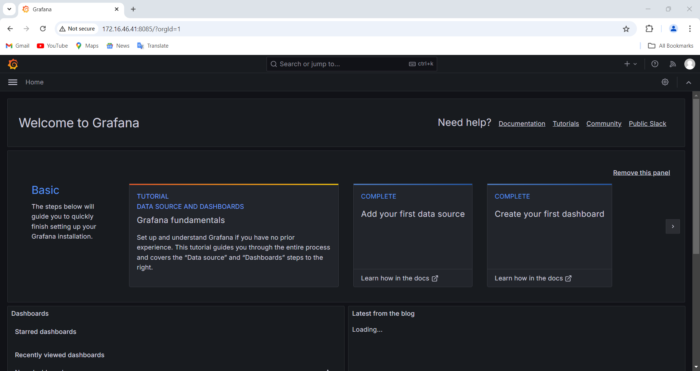
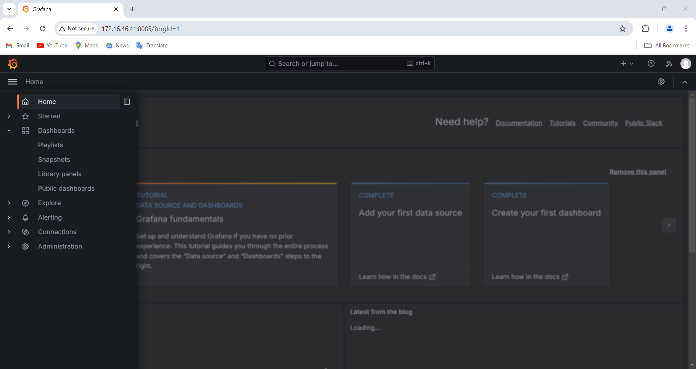
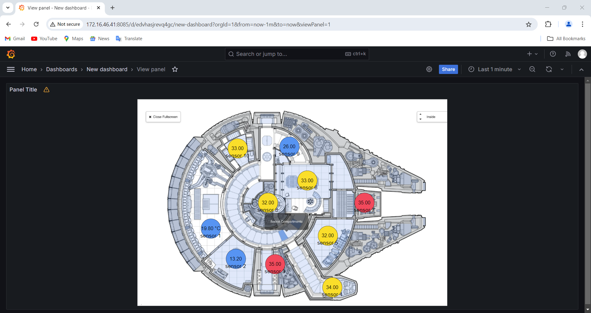

# Data Visualization.

 






``` 
แสดงค่าอุณหภูมิ ความชึ้น ความเข้มแสง แรงดัน 
iot_senser_1  มาจาก Server
iot_senser_2  มาจาก PC
iot_senser_3  มาจาก Cucumber RS ตัวที่ 1 
iot_senser_4  มาจาก Cucumber RS ตัวที่ 2
iot_senser_5  มาจาก Cucumber RS ตัวที่ 3
iot_senser_6  มาจาก Cucumber RS ตัวที่ 4
iot_senser_7  มาจาก Cucumber RS ตัวที่ 5
iot_senser_8  มาจาก Cucumber RS ตัวที่ 6
iot_senser_9  มาจาก Cucumber RS ตัวที่ 7
iot_senser_10 มาจาก Cucumber RS ตัวที่ 8
```





